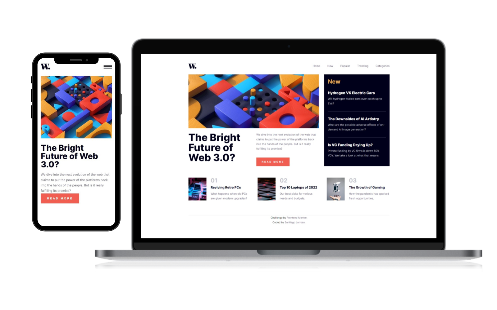

# Welcome to News Homepage!

## About this proyect

It is a challenge proyect supplied by <a href="https://www.frontendmentor.io/profile/SantiNakc">Frontend Mentor</a>

## What did I do?

- I used pure CSS and vanilla JS
- I made a container to make the filter work
- I disable scroll when the nav is open in mobile
- I made it responsive

It was in general an easy layout to practice grid, but it was a bit challenge to make the mobile-nav work as expected.
